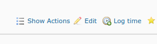

# redmine_showhide_actions

The plugin will automatically hide all 'actions' in an issue as the 'default' behaviour, but provides a button in the contextual icon bar to toggle the show/hide of these:

'Actions' are defined in this context as the contents of the 'details' element in an issue note, including:
- Changes to ticket details (Next Action Date, Assignee etc.)
- Attachments
etc.

To Install:

- Pop folder in the 'plugins' directory
- Run sudo bundle exec rake redmine:plugins:migrate RAILS_ENV=production
- Restart Redmine
